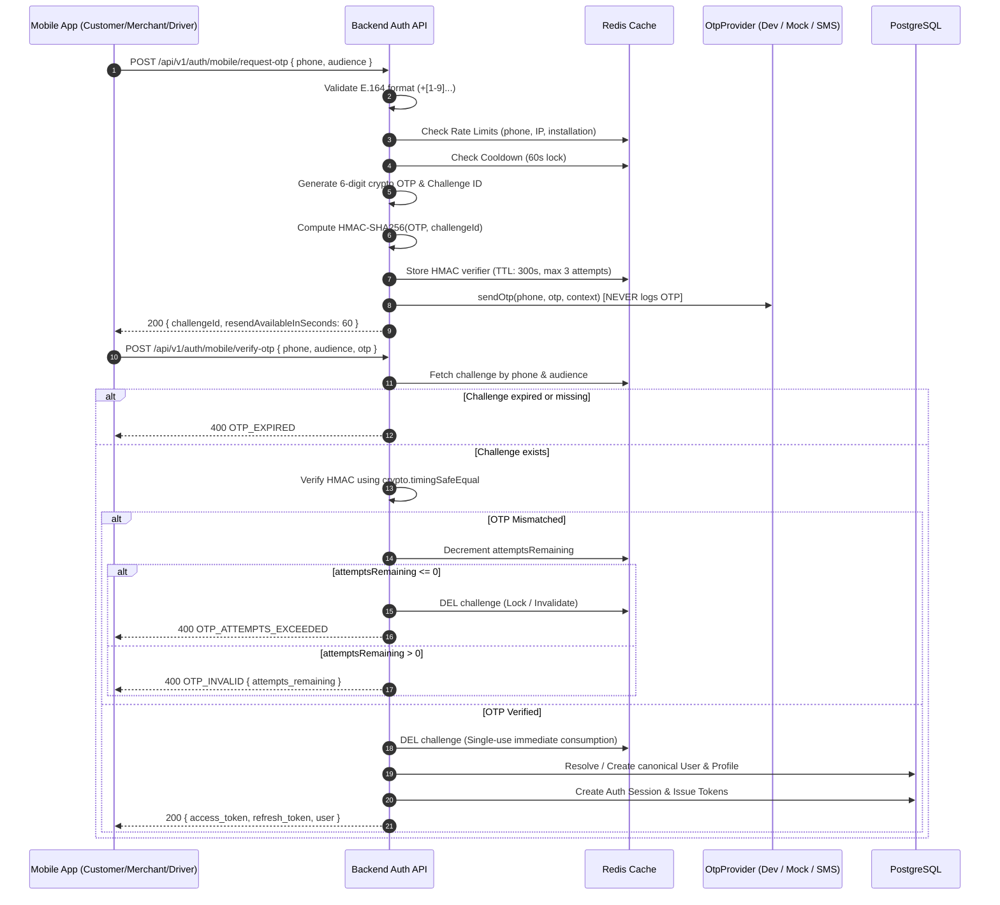
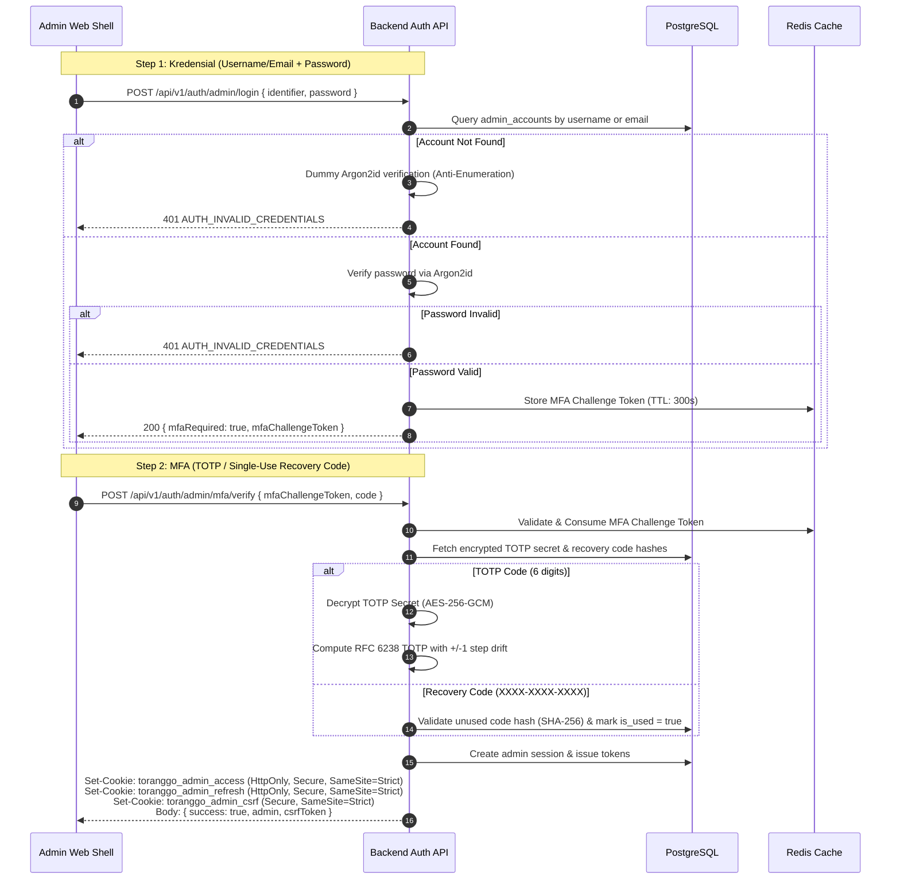

# TorangGo — Identity & Authentication Foundation (Phase 1G)

> [!IMPORTANT]
> **PHASE 1G BOUNDARY ENFORCEMENT**
> Phase 1G implements solely the **identity, authentication, cryptographic token, and authorization foundation** for TorangGo.
> **PHASE 1G DOES NOT IMPLEMENT BUSINESS ONBOARDING OR OPERATIONS.**
> It intentionally contains zero KYC document uploads, store catalog creation, vehicle verification, driver dispatching, shopping carts, order lifecycles, or payment transactions. All business workflows belong strictly to Phase 2.

---

## 1. Canonical Identity Architecture

TorangGo decouples authentication identity from business roles to ensure security, consistency, and a seamless multi-role user experience.

### 1.1 Single Identity Principal (`users` table)
- Every user is uniquely keyed by their **ITU-T E.164** formatted mobile phone number (e.g., `+6281234567890`).
- Whether a user registers/logs in via the Customer App, Merchant App, or Driver App, their authentication resolves to the exact same canonical User record in the `users` table.
- Table columns: `id` (UUIDv7 primary key), `phone` (VARCHAR 20, unique index), `status` (`ACTIVE | SUSPENDED | DELETED`), `created_at`, `updated_at`.

### 1.2 Cross-Role Profile Separation
An individual identity user may hold multiple profiles concurrently without cross-profile data leakage:
- **`customer_profiles`**: Auto-created on first customer authentication or explicitly linked. Contains customer preferences and display name.
- **`merchant_profiles`**: Explicit profile linked to `user_id`. Governed by a lifecycle status: `PENDING | APPROVED | SUSPENDED | REJECTED`.
- **`driver_profiles`**: Explicit profile linked to `user_id`. Governed by a lifecycle status: `PENDING | APPROVED | SUSPENDED | REJECTED`.

### 1.3 Audience Isolation
- Each authentication token is strictly audience-bound (`aud` claim):
  - `CUSTOMER_APP`
  - `MERCHANT_APP`
  - `DRIVER_APP`
  - `ADMIN_WEB`
- Token audience is statically and dynamically checked via `AudienceGuard` (`@RequireAudience(...)`). A Customer token cannot invoke Merchant or Driver endpoints, even though they share the same underlying User entity.

---

## 2. Mobile OTP Lifecycle & State Machine

Mobile login uses a cryptographic, rate-limited One-Time Password (OTP) verification system backed by Redis.

### Key Security Controls:
1. **Zero Raw OTP Logging**: The raw OTP code is NEVER written to logs, Redis, or persistent databases. Only an HMAC-SHA256 verifier is cached in Redis.
2. **Timing-Safe Equality**: HMAC verification uses `crypto.timingSafeEqual` to eliminate timing side-channel attacks.
3. **Strict Attempt Limiting**: Maximum 3 verification attempts. Upon the 3rd failed attempt, the challenge is deleted immediately.
4. **Single-Use Invalidation**: Once verified, the challenge key is immediately deleted from Redis, preventing replay attacks.
5. **Development Provider Fail-Fast**: `DevelopmentOtpProvider` enforces an unconditional runtime exception if initialized when `NODE_ENV === 'production'`.

---

## 3. Cryptographic Token Lifecycle & Anti-Replay

### 3.1 Access Token Specifications
- **Format**: Signed RFC 7519 JSON Web Token (JWT) using HMAC-SHA256 (`HS256`).
- **TTL**: 15 minutes (`900` seconds).
- **Mandatory Claims**:
  - `iss`: Configured issuer (`toranggo-auth`)
  - `sub`: Subject identifier (`user_id` or `admin_id`)
  - `sid`: Authentication session identifier (`auth_sessions.id`)
  - `aud`: Application audience (`CUSTOMER_APP | MERCHANT_APP | DRIVER_APP | ADMIN_WEB`)
  - `jti`: RFC 9562 UUIDv7 unique token identifier
  - `iat`: Unix epoch timestamp issued
  - `exp`: Unix epoch timestamp expiration
- **Zero Mutable Business State**: Access tokens contain **NO mutable business statuses** (such as `user.status`, `merchant.status`, or admin permissions). All mutable state is verified authoritatively against PostgreSQL in real time by route guards.

### 3.2 Refresh Token Rotation & Reuse Detection
- **Format**: 64-character cryptographically random hexadecimal string (256 bits of entropy).
- **Storage**: Only the **SHA-256 hash** of the refresh token is stored in the `refresh_tokens` database table.
- **Single-Use Rotation**: When rotated (`POST /api/v1/auth/refresh`), the presented token is marked `is_consumed = true` with `consumed_at = now()`. A fresh token pair is issued under the same `family_id`.
- **Automatic Reuse Detection**: If an already consumed refresh token is presented again (indicating token theft or replay), the system:
  1. Detects the replay attempt via `is_consumed === true`.
  2. Emits an urgent security warning: `AUTH_REFRESH_REUSE_DETECTED`.
  3. **Immediately revokes the entire token family and the parent authentication session**, invalidating all outstanding tokens for that session.
  4. Returns `401 AUTH_REFRESH_REUSE_DETECTED`.

---

## 4. Admin Web Authentication & RBAC

Admin Web operators authenticate under a dedicated two-step flow with hardware-grade security controls.

### 4.1 Argon2id Password Security
- Standard parameters: Memory cost `65536 KB` (64 MB), Time cost `3` iterations, Parallelism `4` threads.
- Timing-safe dummy evaluation ensures identical latency for non-existent accounts and invalid passwords, preventing username enumeration.

### 4.2 AES-256-GCM Encrypted TOTP Secrets
- TOTP secrets are encrypted at rest using AES-256-GCM with a 32-byte hexadecimal key (`ADMIN_MFA_ENCRYPTION_KEY`).
- Payload format: `ivHex:authTagHex:ciphertextHex`. Any tampering with the ciphertext or authentication tag results in cryptographic failure.

### 4.3 Backup Recovery Codes
- High-entropy recovery codes formatted as `XXXX-XXXX-XXXX`.
- Normalized (case-insensitive, hyphen-tolerant) and hashed with SHA-256 at rest.
- Single-use: once verified, `is_used` is set to `true` with `used_at = now()`. Re-submitting the same recovery code is immediately rejected.

### 4.4 Browser Security & CSRF Defense
- **Session Transport**: Admin Web uses `HttpOnly`, `Secure`, `SameSite=Strict` cookies (`toranggo_admin_access`, `toranggo_admin_refresh`).
- **CSRF Protection**: All mutating browser requests (`POST`, `PUT`, `PATCH`, `DELETE`) require the `X-CSRF-Token` HTTP header matching the `toranggo_admin_csrf` cookie (Double-Submit Cookie Pattern). Verified by `CsrfGuard`.

### 4.5 Admin Role-Based Access Control (RBAC)
- Admin accounts link to `admin_roles` via `admin_account_roles`.
- Roles link to fine-grained `admin_permissions` via `admin_role_permissions`.
- Endpoints are protected with `@RequirePermission(...)` and enforced dynamically by `AdminPermissionGuard`.

---

## 5. Security & Authorization Guards Matrix

| Guard | Decorator / Trigger | Enforcement Logic | Failure Response |
|---|---|---|---|
| `AuthSessionGuard` | `@UseGuards(AuthSessionGuard)` | Validates JWT bearer token or session cookie; verifies session status in DB | `401 UNAUTHORIZED` / `AUTH_SESSION_EXPIRED` |
| `AudienceGuard` | `@RequireAudience(...)` | Ensures JWT `aud` matches endpoint application target | `403 AUTH_AUDIENCE_MISMATCH` |
| `ActiveUserGuard` | `@UseGuards(ActiveUserGuard)` | Verifies user status is `ACTIVE` dynamically in database | `403 AUTH_FORBIDDEN` |
| `ApprovedMerchantGuard` | `@UseGuards(ApprovedMerchantGuard)` | Verifies merchant profile exists and has `status === 'APPROVED'` | `403 AUTH_FORBIDDEN` |
| `ApprovedDriverGuard` | `@UseGuards(ApprovedDriverGuard)` | Verifies driver profile exists and has `status === 'APPROVED'` | `403 AUTH_FORBIDDEN` |
| `AdminPermissionGuard` | `@RequirePermission(...)` | Queries DB for admin's roles & permissions and ensures all required permissions are held | `403 AUTH_FORBIDDEN` |
| `CsrfGuard` | Global / Controller Guard | Verifies `X-CSRF-Token` header equals `toranggo_admin_csrf` cookie for mutating cookie requests | `403 FORBIDDEN` |

---

## 6. Client Adapters

### Mobile Applications
- **Customer Mobile** (`apps/customer-mobile`): Uses `expo-secure-store` with prefix `toranggo_customer:` to safely persist access and refresh tokens.
- **Merchant Mobile** (`apps/merchant-mobile`): Uses `expo-secure-store` with prefix `toranggo_merchant:`.
- **Driver Mobile** (`apps/driver-mobile`): Uses `expo-secure-store` with prefix `toranggo_driver:`.
- **Token Injection**: `ApiClient` configured with `getAuthToken` provider callback to transparently inject `Authorization: Bearer <token>` on all requests.

### Admin Web Portal
- **Admin Web** (`apps/admin-web`): Configured with `credentials: 'include'` for automatic browser cookie transport.
- **CSRF Provider**: Implements `getCsrfToken` callback in `adminApiClient` to inject `X-CSRF-Token` header on mutating calls.
- **2-Step Login UI**: Clean 2-step portal supporting username/email + password, followed by TOTP or backup recovery code input.
- **Header & Session Navigation**: Shell header integrates `useAdminAuth()` displaying authenticated operator details and providing a real logout action.

---

## 7. Quality Gates & Verification Summary

| Suite | Status | Metrics |
|---|---|---|
| Backend Foundation & Security Suite | **PASSED** | 81 tests passing (0 failures) |
| OpenAPI Specification & Drift Check | **PASSED** | 0 drift between backend and `@platform/api-client` |
| Customer Mobile Typecheck | **PASSED** | 0 errors (`tsc --noEmit`) |
| Merchant Mobile Typecheck | **PASSED** | 0 errors (`tsc --noEmit`) |
| Driver Mobile Typecheck | **PASSED** | 0 errors (`tsc --noEmit`) |
| Admin Web Shell Build & Tests | **PASSED** | Production build successful, 7 shell tests passing |
| Database Migration Foundation | **PASSED** | Clean migrations applied to PostgreSQL 17 (14 identity/platform tables) |
