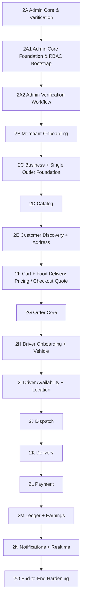

# TorangGo — Product and Engineering Roadmap

This roadmap sequences delivery of **Local Commerce / Food + On-Demand Delivery**. Future verticals are outside the active MVP. Status distinguishes completed implementation from planned scope; the sequence below does not imply that later domains already exist.

## Phase 0 — Product Definition / Specification History

**Historical foundation.** The Historical Master Product Blueprint, early product requirements, architecture notes, identity/order specifications, contracts, and UX maps provide background. They do not override current locked decisions.

## Phase 1 — Engineering Foundation

**COMPLETE / LOCKED.** The authenticated application shells and engineering baseline were delivered through these seven subphases:

| Subphase | Name |
| --- | --- |
| 1A | Project & Monorepo Foundation |
| 1B | Backend Foundation |
| 1C | Database Foundation & Persistence |
| 1D | Shared Contracts |
| 1E | Mobile App Shells |
| 1F | Admin Web Shell |
| 1G | Identity & Auth Implementation |

The shells are foundations for domain functionality, not completed commerce applications.

## Post-Phase-1 Stabilization

**COMPLETE / LOCKED.** Stabilization addressed mobile/Metro compatibility, partner/Mitra audience alignment, browser API credential transport, contract-generation ordering, and backend test isolation. The Mitra repository directory remains `apps/merchant-mobile`.

## Phase 2 — Core Commerce & Delivery

**IN PROGRESS.** Deliver and verify the complete operational Food commerce and delivery loop. The following graph is the canonical sequence; 2A groups the administrative foundation and verification subphases.

### 2A — Admin Core & Verification

Administrative work supports the transactional MVP. It must not replace or indefinitely delay core commerce/delivery progression.

#### 2A1 — Admin Core Foundation & RBAC Bootstrap

**COMPLETE / LOCKED.** Functional checkpoint: `ebb3838888b11ede5a4a150d5a590bbabc05a26a`.

Delivered the granular backend permission foundation, SUPER_ADMIN bootstrap, protected administrative overview, and Admin Web integration with real backend data. Office Admin Security & Runtime Verification is also **COMPLETE / LOCKED**. Prior runtime evidence and Git history normalization are recorded in HANDOFF.md.

#### 2A2 — Admin Verification Workflow

**COMPLETE / LOCKED.** Verification checkpoint: `f54f20550a84d1ddced958f84a8b5be35eb5082e`.

Delivered the authoritative backend verification workflows and dedicated Admin Web control interface for Merchant and Driver profile management:

- **Canonical State Machine:** Strict status transitions across `PENDING`, `APPROVED`, `REJECTED`, and `SUSPENDED` enforced for both Merchant and Driver queues.
- **Reason & Audit Enforcement:** Mandatory validation of transition reasons and immutable append-only audit trail logging (`profile_verification_audit_logs`) capturing actor, timestamps, from/to states, reason, and request correlation IDs.
- **Concurrency & Atomicity:** Row-level locking (`FOR UPDATE`) preventing race conditions during concurrent admin reviews; atomic rollback on audit failure; database-backed idempotency protection on mutations.
- **RBAC Enforcement:** Granular permissions (`admin:access + admin:read` for inspection, `admin:access + admin:write` for approve/reject, `admin:access + admin:write + admin:ops` for suspend/reactivate) strictly validated at backend guards.
- **Admin Web Experience:** Real-time queue filtering, search, pagination, detailed profile inspection, audit history timeline, and enforcement of the terminal rejected state for admin mutations.

### 2B — Merchant Onboarding

**COMPLETE / LOCKED.** Checkpoint: `63a1565140a35c7b9cb1bc48d09f0c83cebeaea3` (GitHub Actions CI Run #10: SUCCESS).

**Mobile milestone:** TorangGo Mitra begins substantial real business functionality through onboarding.
Delivered the complete partner onboarding lifecycle from TorangGo Mitra application through Admin verification:

- **Draft & Autosave Lifecycle:** Authenticated partners create, autosave, and resume a single active onboarding draft across sessions.
- **5-Step Onboarding Wizard:** Structured progression capturing Owner Information (Full Name, NIK, synced Account Phone, Email), Proposed Business Information, Correspondence Address, Private Front-Side KTP Document upload (hardened with magic byte MIME sniffing and path traversal prevention), and mandatory declaration/data-accuracy consents.
- **Immutable Submission Snapshots:** First submit atomically creates `merchant_profiles` + immutable `merchant_onboarding_submissions` (revision #1, `PENDING`) and purges the draft.
- **Rejection & Revision Lifecycle:** Rejected applications can be repaired via an explicit repair endpoint that clones the previous submission into a new mutable draft. Resubmission creates an immutable revision #2 for subsequent Admin review.
- **Stale Admin Review Guard:** Enforces optimistic concurrency via `expectedSubmissionId`; returns 409 Conflict if an admin attempts to decide on a submission that the merchant has already revised.
- **Admin Review Capabilities:** Admin verification page features default NIK masking with authorized reveal, private streaming of KTP documents with authorization boundaries, and atomic approve/reject decisions.
- **Product Boundaries:** Onboarding establishes partner capability/identity only; proposed business data is not the final operational Business; correspondence address is not the Outlet address; KTP documents are private; `APPROVED` status does not grant order readiness; Business/Outlet creation is deferred to Phase 2C.

**Mobile milestone:** TorangGo Mitra delivered its comprehensive 6-state onboarding gate (`NOT_STARTED`, `DRAFT`, `PENDING`, `APPROVED`, `REJECTED`, `SUSPENDED`) and interactive 5-step form wizard with local autosave indicators.

### 2C — Business + Single Outlet Foundation

**NEXT / NOT STARTED.** Concept Anchor v1.0 is **LOCKED**; implementation is **NOT STARTED**.

Phase 2C establishes the operational commercial Business and physical primary Outlet for verified merchants.

- **Precondition:** Begins only after partner identity reaches `APPROVED` state.
- **Domain Structure:** Follows `USER → MERCHANT PROFILE → BUSINESS → OUTLET`. Schema models Business-to-Outlet as one-to-many (1:N), while MVP UX strictly manages one Primary Outlet per Business.
- **Setup Draft Lifecycle:** Introduces a mutable Business Setup Draft with autosave and resume capabilities before operational records are created.
- **4-Step Setup Wizard:**
  - **Step 1 — Informasi Usaha:** Business name, category, and description (prefilled where appropriate from approved 2B submission, fully editable).
  - **Step 2 — Outlet Utama:** Primary Outlet name, contact phone, and physical fulfillment address (province, regency/city, district, village/subdistrict, detailed address, optional postal code; strictly separate from 2B correspondence address).
  - **Step 3 — Lokasi & Jam Operasional:** Map pin / geographic coordinate selection persisted via PostGIS `geography(Point, 4326)`, canonical IANA timezone assignment (e.g., `Asia/Makassar`), and basic Monday–Sunday operating hours (one opening interval per open day).
  - **Step 4 — Review & Complete:** Full operational review followed by atomic creation of Business, Primary Outlet, and Operating Hours within a single database transaction protected by idempotency and concurrency controls.
- **Operational Mutability:** Business and Outlet entities are mutable operational records after setup. Edits never alter historical Phase 2B onboarding submissions.
- **Suspension Preservation:** Admin suspension preserves existing Business, Outlet, and Operating Hours data without deletion or unlinking; reactivated merchants retain their operational setup.
- **Mobile Gate Progression:** Extends TorangGo Mitra gate to distinguish between setup not started, setup draft in progress, and operational setup completed. UI explicitly avoids claiming "Toko Anda sudah aktif menerima pesanan" since Catalog and Order capabilities are not yet active.
- **Operational Readiness Distinction:** `merchant_profile.status = APPROVED` represents identity approval, distinct from full operational readiness (which additionally requires Phase 2C setup, Phase 2D catalog/menu, and subsequent milestones).
- **Admin Visibility:** Extends Admin merchant detail with read-only operational visibility; excludes admin editing of operational businesses.
- **Strict Scope Firewall:** Excludes Catalog/Menu, products, pricing, stock, cart, checkout, orders, payments, driver matching, delivery radiuses/zones, wallet, ledger, and multi-outlet management.

### 2D — Catalog

Deliver the concrete Food catalog and Merchant management experience, including item information, pricing, and availability as specified for this phase.

### 2E — Customer Discovery + Address

Deliver location-aware discovery and customer delivery-address functionality using the relational/geospatial foundation.

**Mobile milestone:** TorangGo Customer begins substantial real commerce functionality.

### 2F — Cart + Food Delivery Pricing / Checkout Quote

Deliver cart validation, Food Delivery pricing, and checkout quotes. Concrete fee rules are defined in this phase; universal multi-vertical pricing is outside scope.

### 2G — Order Core

Deliver order creation, snapshots/history, Merchant handling, preparation, and pickup readiness within one authoritative lifecycle. Exact state names and transitions are deferred to dedicated Order design.

### 2H — Driver Onboarding + Vehicle

Deliver Driver identity/profile onboarding and related Vehicle registration/verification. Driver and Vehicle remain separate domain concepts.

**Mobile milestone:** TorangGo Driver begins substantial operational functionality.

### 2I — Driver Availability + Location

Deliver availability and location tracking for active Drivers. Redis may support high-frequency/latest location; PostGIS remains the relational/geospatial persistence foundation. Persistence/history policies require dedicated design.

### 2J — Dispatch

Dispatch is **FOOD_DELIVERY-first**. Design Driver matching and assignment for the active operational vertical. No exact matching, broadcast, timing, or food-ready-time algorithm is locked by this roadmap.

### 2K — Delivery

Deliver pickup and customer delivery execution, tracking, and confirmation according to dedicated delivery design.

### 2L — Payment

Planned scope may include payment integration, provider/webhook integrity, idempotency, and payment-state reconciliation. No payment method, provider, or gateway is permanently selected here.

### 2M — Ledger + Earnings

Establish ledger-backed financial attribution for Merchant earnings, Driver earnings, and Platform revenue. Accounting structure, posting moments, settlement/reconciliation rules, and payout mechanics require explicit design in this phase.

### 2N — Notifications + Realtime

Deliver notifications and realtime updates across Customer, Mitra, and Driver for relevant transaction milestones.

### 2O — End-to-End Hardening

Verify the full lifecycle, operational failure/recovery cases, consistency, performance, and readiness for real operation. Integration must demonstrate discovery, quote, ordering, Merchant preparation, Driver dispatch/pickup/delivery, payment reconciliation, and ledger-backed attribution according to approved phase designs. This is a success criterion, not a fixed accounting posting sequence.

## Phase 3 & Beyond — Operational / Product Expansion

**FUTURE.** After the first operational vertical is proven, expansion may include Courier, Mart, Ride, Pharmacy Delivery, and Home / On-Demand Services. These are **FUTURE / NOT CURRENT MVP** examples. Exact rollout order and future phase numbering are not locked.

## Parked Initiatives

- Multi-market / Kabupaten expansion: prove one operational market first.
- Service Provider capability/domain: future Mitra capability with distinct backend domain responsibilities.
- Torang Jual / C2C marketplace.
- Multi-outlet/franchise management.
- Universal multi-service booking, pricing, and dispatch abstractions.

Reactivation requires explicit prioritization and design review, not speculative implementation during Phase 2.
