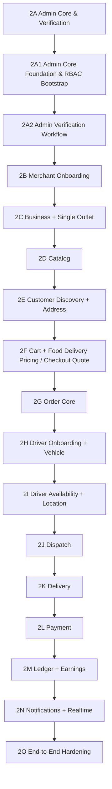

# TorangGo — Product and Engineering Roadmap

This roadmap sequences delivery of **Local Commerce / Food + On-Demand Delivery**. Future verticals are outside the active MVP. Status distinguishes completed implementation from planned scope; the sequence below does not imply that later domains already exist.

## Phase 0 — Product Definition / Specification History

**Historical foundation.** The Historical Master Product Blueprint, early product requirements, architecture notes, identity/order specifications, contracts, and UX maps provide background. They do not override current locked decisions.

## Phase 1 — Engineering Foundation

**COMPLETE / LOCKED.** The authenticated application shells and engineering baseline were delivered through these seven subphases:

| Subphase | Name |
| --- | --- |
| 1A | Project & Monorepo Foundation |
| 1B | Backend Foundation |
| 1C | Database Foundation & Persistence |
| 1D | Shared Contracts |
| 1E | Mobile App Shells |
| 1F | Admin Web Shell |
| 1G | Identity & Auth Implementation |

The shells are foundations for domain functionality, not completed commerce applications.

## Post-Phase-1 Stabilization

**COMPLETE / LOCKED.** Stabilization addressed mobile/Metro compatibility, partner/Mitra audience alignment, browser API credential transport, contract-generation ordering, and backend test isolation. The Mitra repository directory remains `apps/merchant-mobile`.

## Phase 2 — Core Commerce & Delivery

**IN PROGRESS.** Deliver and verify the complete operational Food commerce and delivery loop. The following graph is the canonical sequence; 2A groups the administrative foundation and verification subphases.

### 2A — Admin Core & Verification

Administrative work supports the transactional MVP. It must not replace or indefinitely delay core commerce/delivery progression.

#### 2A1 — Admin Core Foundation & RBAC Bootstrap

**COMPLETE / LOCKED.** Functional checkpoint: `ebb3838888b11ede5a4a150d5a590bbabc05a26a`.

Delivered the granular backend permission foundation, SUPER_ADMIN bootstrap, protected administrative overview, and Admin Web integration with real backend data. Office Admin Security & Runtime Verification is also **COMPLETE / LOCKED**. Prior runtime evidence and Git history normalization are recorded in HANDOFF.md.

#### 2A2 — Admin Verification Workflow

**NEXT / NOT STARTED.** Review Merchant/Driver submissions and support controlled status changes with authorization and audit requirements.

Exact states, transitions, mutation endpoints, and onboarding document schemas must be defined in the dedicated Phase 2A2 Master Prompt after the documentation checkpoint. This task implements none of them.

### 2B — Merchant Onboarding

Planned scope may include Merchant identity/profile, owner/contact information, required verification documents, agreement/consent where applicable, submission/review status, and review feedback.

**Mobile milestone:** TorangGo Mitra begins substantial real business functionality through onboarding.

### 2C — Business + Single Outlet

Establish the commercial Business and physical Outlet. The MVP operational assumption is 1 Merchant → 1 Business → 1 Outlet, with outlet location, hours, and operational availability addressed in dedicated design.

### 2D — Catalog

Deliver the concrete Food catalog and Merchant management experience, including item information, pricing, and availability as specified for this phase.

### 2E — Customer Discovery + Address

Deliver location-aware discovery and customer delivery-address functionality using the relational/geospatial foundation.

**Mobile milestone:** TorangGo Customer begins substantial real commerce functionality.

### 2F — Cart + Food Delivery Pricing / Checkout Quote

Deliver cart validation, Food Delivery pricing, and checkout quotes. Concrete fee rules are defined in this phase; universal multi-vertical pricing is outside scope.

### 2G — Order Core

Deliver order creation, snapshots/history, Merchant handling, preparation, and pickup readiness within one authoritative lifecycle. Exact state names and transitions are deferred to dedicated Order design.

### 2H — Driver Onboarding + Vehicle

Deliver Driver identity/profile onboarding and related Vehicle registration/verification. Driver and Vehicle remain separate domain concepts.

**Mobile milestone:** TorangGo Driver begins substantial operational functionality.

### 2I — Driver Availability + Location

Deliver availability and location tracking for active Drivers. Redis may support high-frequency/latest location; PostGIS remains the relational/geospatial persistence foundation. Persistence/history policies require dedicated design.

### 2J — Dispatch

Dispatch is **FOOD_DELIVERY-first**. Design Driver matching and assignment for the active operational vertical. No exact matching, broadcast, timing, or food-ready-time algorithm is locked by this roadmap.

### 2K — Delivery

Deliver pickup and customer delivery execution, tracking, and confirmation according to dedicated delivery design.

### 2L — Payment

Planned scope may include payment integration, provider/webhook integrity, idempotency, and payment-state reconciliation. No payment method, provider, or gateway is permanently selected here.

### 2M — Ledger + Earnings

Establish ledger-backed financial attribution for Merchant earnings, Driver earnings, and Platform revenue. Accounting structure, posting moments, settlement/reconciliation rules, and payout mechanics require explicit design in this phase.

### 2N — Notifications + Realtime

Deliver notifications and realtime updates across Customer, Mitra, and Driver for relevant transaction milestones.

### 2O — End-to-End Hardening

Verify the full lifecycle, operational failure/recovery cases, consistency, performance, and readiness for real operation. Integration must demonstrate discovery, quote, ordering, Merchant preparation, Driver dispatch/pickup/delivery, payment reconciliation, and ledger-backed attribution according to approved phase designs. This is a success criterion, not a fixed accounting posting sequence.

## Phase 3 & Beyond — Operational / Product Expansion

**FUTURE.** After the first operational vertical is proven, expansion may include Courier, Mart, Ride, Pharmacy Delivery, and Home / On-Demand Services. These are **FUTURE / NOT CURRENT MVP** examples. Exact rollout order and future phase numbering are not locked.

## Parked Initiatives

- Multi-market / Kabupaten expansion: prove one operational market first.
- Service Provider capability/domain: future Mitra capability with distinct backend domain responsibilities.
- Torang Jual / C2C marketplace.
- Multi-outlet/franchise management.
- Universal multi-service booking, pricing, and dispatch abstractions.

Reactivation requires explicit prioritization and design review, not speculative implementation during Phase 2.
